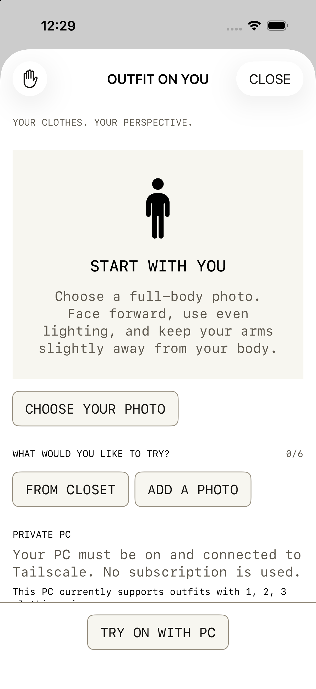
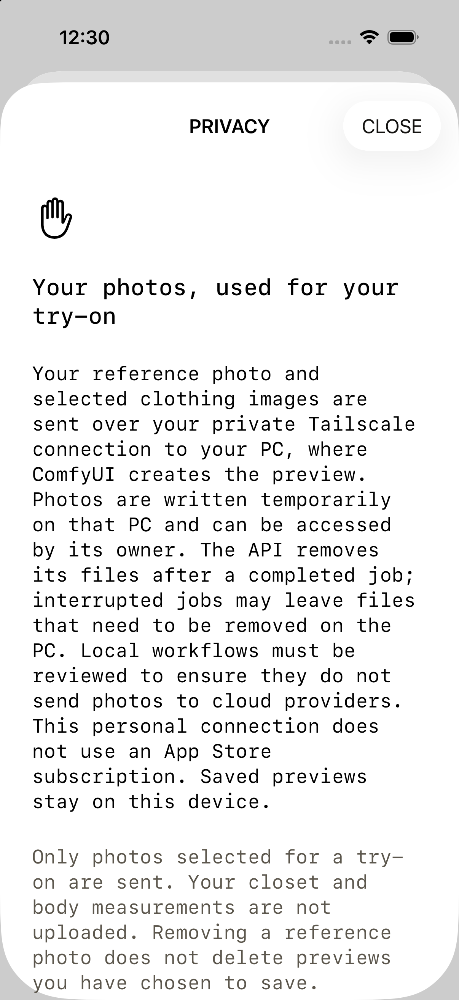

# Private PC image API

This adds a personal Debug connection from **Outfit on you** to ComfyUI on a Windows PC:

`Pyxis → HTTPS over Tailscale → loopback Python API → loopback ComfyUI → installed image-edit model`

The production Cloudflare/xAI service remains available separately. A Cloudflare Worker cannot directly reach a private tailnet address; this personal mode connects from the device itself. The PC and device must be on the same authorized tailnet. The PC integration is not an App Store billing backend. Release builds strip the PC URL and test credential and reject the PC privacy contract.

## Current verification boundary

The adapter and client are implemented and tested with synthetic images and a local fake ComfyUI HTTP server. On September 21, 2026, the Windows PC was reached through the existing tailnet SSH bridge. Its ComfyUI install is `C:\AI\ComfyUI_Qwen` on loopback port 8188, with local Qwen Image 2.1 weights (`qwen_image_2.1_int8_convrot`, `qwen3vl_8b_w4a8`, and `qwen_image_2.1_vae_bf16`). A reviewed one-person, one-garment API workflow completed one synthetic geometric job through the loopback API in 22.83 seconds, returned a JPEG, and removed that job's input and output files. A wrong token was refused. From the Mac, Tailscale Serve on HTTPS port 8443 reached the API's health route. The existing HTTPS 443 mapping was left unchanged.

Real person or garment photos, try-on fidelity, garment counts above one, the cleanup workflow, and the physical iPhone flow are not verified. The synthetic result was a generated picture, not a faithful transfer of the placeholder garment. Starting ComfyUI pauses the PC's local language-model server because both need the same GPU memory; stopping the image services restores that server. Do not treat this run as a quality or cost benchmark.

## PC setup

Use Python 3.11 or newer and the existing ComfyUI installation. In `backend/pyxis-pc-api`:

```powershell
py -3.12 -m venv .venv
.\.venv\Scripts\python -m pip install -r requirements.txt
Copy-Item config.example.json config.local.json
```

Edit `config.local.json` to use the real ComfyUI root and loopback port. ComfyUI's input/output directories must be the standard `input` and `output` folders in that root. If the installation overrides those folders, configure a dedicated instance or adapt the path settings before use. Do not interrupt another running GPU service; the image model may compete with the PC's language model for VRAM.

Create API exports from working image-edit workflows in ComfyUI (**Export (API)**), save them under the ignored `workflows/` directory, and reference only workflows actually tested locally. Each `try-on-N` workflow must support **N+1 input images**: the original person first, followed by N garments. No automatic sequential edits or substitution with text-to-image are attempted.

Replace the selected node input values with exact markers:

| Marker | Value supplied by Pyxis |
| --- | --- |
| `{{image_1}}` | Original person, or cleanup source |
| `{{image_2}}` … `{{image_7}}` | Garment references in order |
| `{{prompt}}` | Fixed server prompt with validated garment categories |
| `{{seed}}` | Optional randomized numeric seed |

All image markers for a workflow and a prompt marker are required. Use `SaveImage` as the output; the API overrides its prefix to a unique `pyxis/<job>/preview`. Remove `PreviewImage` nodes. Never leave an unrelated person's file in a `LoadImage` input. This is a template binding system, not a universal conversion of arbitrary text-to-image graphs into editing graphs.

Review **all nodes**, including custom nodes, before setting `local_workflows_reviewed` to `true`: no cloud API nodes, outbound image uploads, unexpected logging, extra file writers, or persistent previews. Workflows are operator-controlled code and must be trusted. Marker validation cannot prove that a graph is local-only or that a model preserves clothing accurately. Test one synthetic person/garment pair first, then add other verified counts. The app disables unsupported garment counts.

Generate a random token locally and store it in a password manager or protected process environment. Set it as `PYXIS_PC_TOKEN` (at least 32 characters) without committing it or sending it through Telegram. Start:

```powershell
.\.venv\Scripts\python server.py --config config.local.json
```

The API listens only at `127.0.0.1:8790`. Keep ComfyUI on loopback. After reviewing existing `tailscale serve status`, expose the adapter privately on an unused HTTPS port:

```powershell
tailscale serve --bg --https=8443 http://127.0.0.1:8790
tailscale serve status
```

Use **Serve**, never Funnel. Keep the existing 443 service intact. Restrict tailnet access to intended devices with the existing tailnet policy. Verify the reported HTTPS URL from the Mac before configuring Pyxis. Do not disable certificate validation or open public router/firewall ports. To remove only this mapping: `tailscale serve --https=8443 off`.

See the official [ComfyUI routes](https://docs.comfy.org/development/comfyui-server/comms_routes), [API workflow example](https://github.com/Comfy-Org/ComfyUI/blob/master/script_examples/basic_api_example.py), and [Tailscale Serve reference](https://tailscale.com/docs/reference/tailscale-cli/serve).

## Debug app configuration

In the ignored `config/Pyxis.local.xcconfig`, set:

```xcconfig
PYXIS_PC_BASE_URL = https:/$()/YOUR-PC.YOUR-TAILNET.ts.net:8443
PYXIS_TRY_ON_TEST_TOKEN = YOUR-PRIVATE-PC-TOKEN
```

Use the token configured on the PC. This is a personal test credential embedded only in Debug builds; do not distribute that build or its token. `PYXIS_PC_BASE_URL` overrides only try-on. The existing garment-cleanup app action still uses its original xAI gateway and disclosure. The PC API also offers cleanup to explicitly consented API clients, but this PR does not silently reroute that action.

Open **Build → Outfit on you**. The private mode shows `PRIVATE PC`, its supported outfit counts, and a new disclosure. Existing xAI permission does not authorize PC processing. No subscription is used. The compatibility allowance fields always report 100 available slots; they are not purchased credits or a billing ledger, and the UI hides monthly billing controls in this mode.

## API contract

| Route | Request | Result |
| --- | --- | --- |
| `GET /health` | None | Adapter liveness |
| `GET /v1/try-on/config` | None | ComfyUI reachability, PC privacy contract, supported counts |
| `GET /v1/try-on/usage` | `Authorization: Test <token>` | Personal-mode compatibility allowance |
| `POST /v1/try-on/generate` | Same auth, `X-Pyxis-Consent: try-on-pc-local-v1`, UUID `Idempotency-Key`; multipart `person`, consecutive `garment_1...N`, JSON `categories` | JPEG bytes |
| `POST /v1/ai/garment-cleanup` | Same auth, consent and job headers; multipart `source` | JPEG bytes |

Health/configuration do not prove model quality. Each input is bounded at 4 MB and 25 megapixels; total upload is bounded at 32 MB; output is bounded at 20 MB. Inputs and returned images are decoded/re-encoded to strip metadata. The model receives the original person and all selected garments in one job. Redirects and remote model URLs are not used.

One request runs at a time. Busy requests return 409 without queuing GPU work. Successful bytes can be replayed for 60 seconds in memory. A SQLite journal contains UUIDs/timestamps only and prevents rerunning a request after a restart, expired replay, or uncertain failure. It is deliberately conservative: an interrupted or failed submitted job requires inspection and a deliberate new generation. There are no automatic retries and no subscription charges.

## Local files and interrupted work

Unlike xAI ZDR, this API **writes temporary files to the PC**. The owner can access them. Completed jobs remove their own input/output folders and attempt to remove their ComfyUI history entry. The shared GPU process can retain tensors in memory. The API does not clear the global cache or stop unrelated work.

If the process crashes, the model times out, or a connection fails after submission, isolated `input/pyxis/<UUID>` and `output/pyxis/<UUID>` files can remain. After confirming that job is no longer queued/running, remove those specific folders and its history entry in ComfyUI. Never delete all ComfyUI input/output folders. Existing user files are outside the API's cleanup scope. Do not reset `jobs.local.sqlite3` to retry an ambiguous request; inspect the job first and start a new preview deliberately. Restarting the API alone cannot establish that a GPU job has stopped.

## Simulator proof

The following screenshots use a temporary synthetic configuration, not the real PC. The temporary mock was removed from source after inspection.




## Verification

```powershell
.\.venv\Scripts\python -m unittest discover -s tests -v
```

From the repository root, run `./scripts/test.sh` and `./scripts/deployment_preflight.sh static`. Before using real photos, verify authentication rejection, unsupported counts, model-offline behavior, synthetic generation, and removal of the generated job files on the PC. Then check a real opt-in try-on on a physical device, with Tailscale connected, including app backgrounding and poor-network recovery. A synthetic PC job does not establish real-person or garment fidelity.
